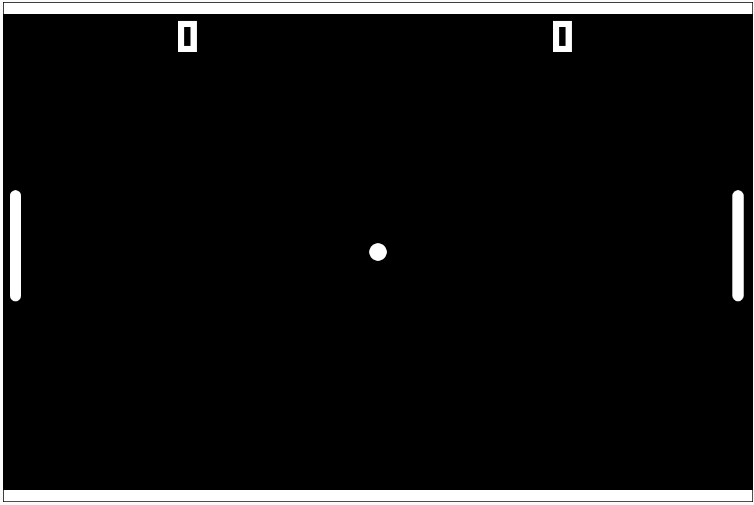

<h1 align = "center"> Pong <h1>
<h3 align = "center"> By SrBieelx <h3>

Jogo feito com ajuda da Alura e seu curso de Lógica de programação: começe em lógica com o jogo Pong e JavaScript.  

## 🚀 Tecnologias

Esse projeto foi desenvolvido com a seguinte tecnologia:
- JavaScript

## 💻 Projeto
Esse jogo foi baseado no clássico Pong

<h3 align = "center"> Sons utlizados: Minecraft Bow // MMinecaft EXP orb // Skyrim NPC music - Harvest dawn